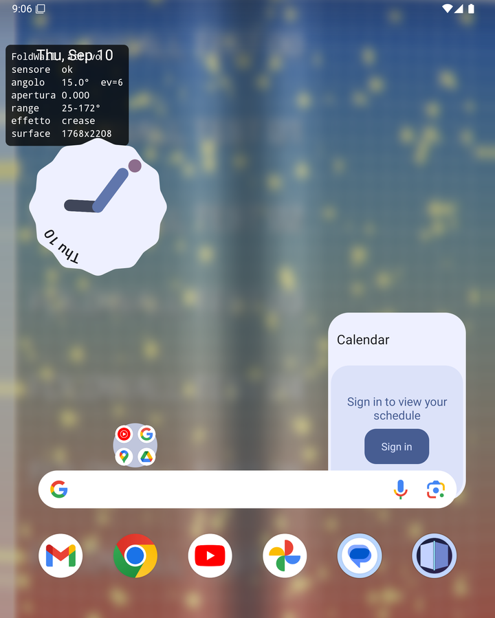
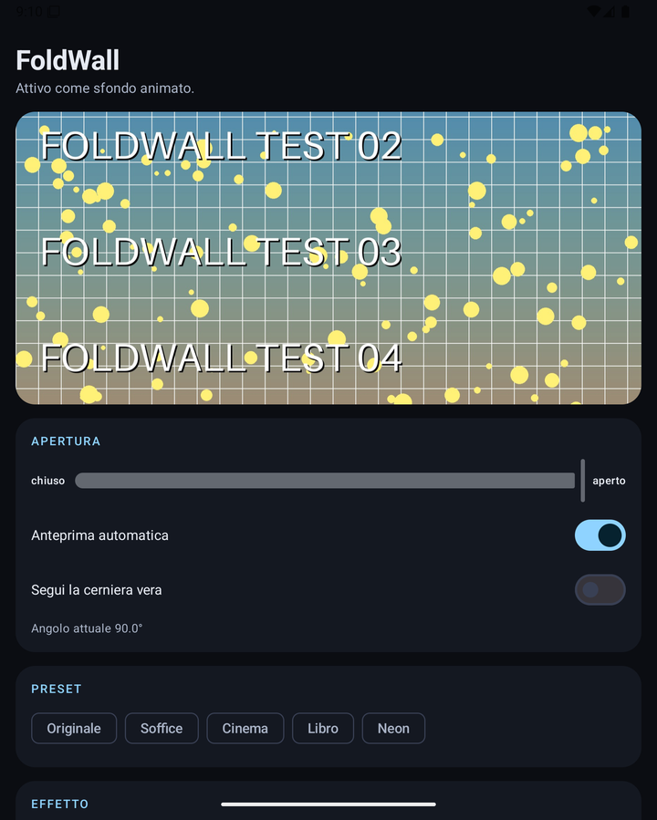

# FoldWall

An Android live wallpaper that reacts to the **hinge angle** of a foldable: as you open
and close the device the wallpaper blurs, bends, darkens and tints in real time, driven
by an AGSL shader.

Inspired by the unfolding animation on Apple's foldable iPhone. This is *not* that
animation — see [What this can and cannot do](#what-this-can-and-cannot-do).

Built for the Galaxy Z Fold 8. Verified so far on the Android Studio
`7.6" Fold-in with outer display` emulator (API 35): all five effects, the live
hinge sensor, the settings-to-wallpaper live update and the diagnostic overlay.
Real-device results will be added here once they exist.

> The app UI is in Italian.





---

## What it does

`Sensor.TYPE_HINGE_ANGLE` (public Android API since API 30) drives a `RuntimeShader`
that is applied through a `RenderEffect` chain. Six styles, all fully adjustable:

| Effect | What it looks like |
| --- | --- |
| **Duo** | The whole frame defocuses and dims as one and comes back sharp when flat. No crease, no warp — the *display* goes out of focus, not the wallpaper behind it. The default, and the closest to the real thing. |
| **Piega** (crease) | Shadow valley along the hinge with a lit edge either side. |
| **Vetro** (glass) | Lens refraction along the crease, like frosted glass bending. |
| **Pagina** (page) | The right half curls onto a cylinder like a turning page, with a spine shadow. |
| **Profondità** (depth) | No warp: zoom, vignette and blur only. The restrained one. |
| **Onda** (ripple) | A wave leaving the crease and damping towards the edges. |

Adjustable per effect: intensity, maximum blur, darkening, desaturation, chromatic
aberration, crease width, response speed, tint colour and amount, crease glow colour and
amount, and an invert switch that moves the effect to the open end of the travel.

Six presets (Duo, Originale, Soffice, Cinema, Libro, Neon) set a whole look at once. `Duo` is
built from a reconstruction of the real transition: a 72px blur over the whole frame and a
darkening strong enough to read as the panel going out, with nothing else.

Pick any photo as the wallpaper image, or leave it empty and use the built-in gradient
with two configurable colours.

## Why the calibration section exists

The range of hinge angles a **live wallpaper** actually observes is not the full 0–180°.
The engine only receives sensor events while its own panel is lit, and the firmware lights
the inner panel part-way through an unfold — on a Galaxy Fold around 90°. Mapped over
0–180° the effect is therefore more than half finished before anyone can see it, which
reads as an animation that arrives already over.

So the app does not guess, and it does not make the user guess either: the engine records
the span of angles it is actually given, and the settings screen offers that span back with
a single button. A few folds are enough. The diagnostic overlay is still there for anyone
who wants the raw numbers — sensor presence, angle, event count, computed openness, the
configured range, the active effect and the surface size.

`Sfocatura al massimo a metà apertura` changes the blur from growing with the fold to
peaking half-open and clearing at both ends, which reads as an optical transition rather
than a wallpaper that is simply blurred while the phone is shut.

## Full-screen mode (experimental)

There is a second mode that runs the same effect over *everything*, not just the
wallpaper. It is off by default and has its own switch in the app.

How it works, and why it works that way:

1. `MediaProjection` mirrors the display into a parked virtual display that produces
   nothing while idle.
2. When the hinge starts moving, the display is un-parked for exactly one frame, that
   frame is turned into a bitmap, and the display is parked again.
3. The frozen frame goes into a `TYPE_APPLICATION_OVERLAY` window with the shader applied
   through `View.setRenderEffect`, driven by the live hinge angle.
4. When the hinge settles the overlay fades out and the real screen is back.

Capturing exactly one frame per fold is not an optimisation, it is the design. The virtual
display mirrors display 0, which is where the overlay lives — a continuous mirror would
feed the effect back into itself. It also sidesteps the Android 14 rule that a
`MediaProjection` may be used for exactly one `createVirtualDisplay` call: the display is
created once and gated with `VirtualDisplay.setSurface(null)`, which the platform treats
like switching a screen off.

What it costs, all of it visible to the user:

- Android asks for screen-capture consent every time the mode is switched on, and the
  recording indicator stays lit.
- The overlay window is **touchable**. An untrusted overlay that lets touches through is
  capped at 80% opacity by the platform's anti-tapjacking rule, and at 80% the frozen
  frame blends with the live screen and reads as a rendering fault. So it takes the taps
  instead — and a tap dismisses it immediately.
- Apps that set `FLAG_SECURE` (banking, DRM video, password managers) are captured black.
- The status bar stays above the overlay.
- The mode dies with the process: after a reboot or a swipe from recents it is off until
  the user consents again.

## What this can and cannot do

**It can**: react to the hinge behind the real launcher, continuously, as a normal
wallpaper — no root, no ADB tricks, no special permissions. With the experimental mode on,
it can also paint the effect over other apps for the duration of a fold.

**It cannot**: reproduce the system-level unfold transition. A third-party app cannot
touch SystemUI's display handover, and there is a brief black/snapshot gap during the
physical panel swap that belongs to the system. The full-screen mode is an illusion built
from a screenshot, not that transition. Only the OEM (or a rooted SystemUI hook) can do
the authentic version.

Cover-screen support is not implemented in v1.

## Build

Requirements: JDK 17, Android SDK with platform 36.

```bash
./gradlew assembleDebug
```

The debug APK lands in `app/build/outputs/apk/debug/`. `minSdk` is 33, because
`RuntimeShader` (AGSL) became public API in Android 13.

### Release build

`app/build.gradle.kts` reads signing credentials from a `keystore.properties` file in
the repository root, which is **not** in version control. Without it the release build
still runs and produces an unsigned APK.

```properties
storeFile=foldwall-release.jks
storePassword=...
keyAlias=foldwall
keyPassword=...
```

`storeFile` is resolved against the repository root, so a bare filename means a
`.jks` next to `keystore.properties`. There is a `keystore.properties.example` to
copy. Create your own keystore with:

```bash
keytool -genkeypair -v -keystore foldwall-release.jks -storetype PKCS12 -keyalg RSA -keysize 4096 -validity 10000 -alias foldwall -dname "CN=FoldWall, O=FoldWall, C=IT"
```

PKCS12 requires the key password to equal the store password. Then
`./gradlew assembleRelease`.

## Install

A built APK is available at
<https://step.prandi.net/portal/downloads/FoldWall.apk>, or build one yourself:

```bash
adb install -r app-debug.apk
```

Then open the app and press **Imposta come sfondo**, or pick FoldWall from
Settings → Wallpaper → Live wallpapers.

## How it is put together

| File | Role |
| --- | --- |
| `FoldShaders.kt` | Shared AGSL prelude/epilogue: chromatic aberration, crease glow, colour grading. |
| `FoldEffect.kt` | One `warp()` / `shade()` pair per effect, spliced into the shared scaffolding. |
| `FoldEffectBuilder.kt` | Settings + openness → `RenderEffect`. The one place the effect is defined, shared by both hosts. |
| `FoldRenderer.kt` | `HardwareRenderer` + two `RenderNode`s, for the wallpaper and the in-app preview. |
| `HingeSource.kt` | `SensorManager` wrapper over `TYPE_HINGE_ANGLE`. |
| `FoldWallpaperService.kt` | The wallpaper engine. Draws only while visible *and* while the angle is still moving. |
| `FoldPreviewView.kt` | The same renderer on a `SurfaceView`, so the settings screen previews the real thing. |
| `OverlayFoldService.kt` | The experimental full-screen mode: capture one frame, show it, drop it. |
| `FoldOverlayView.kt` | The overlay's content — a plain `View` with `setRenderEffect` over the frozen frame. |

Two details worth knowing if you fork this:

- A `RenderEffect` captures its shader's uniforms at construction, so it must be rebuilt
  every frame. Calling `setFloatUniform` on the shader afterwards changes nothing.
- The blur uses `RenderEffect.createBlurEffect(..., Shader.TileMode.CLAMP)`. Without
  CLAMP the edges of the wallpaper fade to transparent.
- The overlay renders through a plain `View` with `setRenderEffect` rather than a
  `SurfaceView`. The effect then lives inside the window's own rendering: no second
  composited layer, no surface lifecycle to keep in step with the window's.

## Licence

MIT — see [LICENSE](LICENSE).
